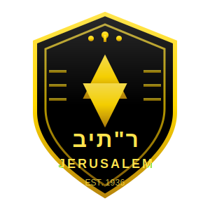
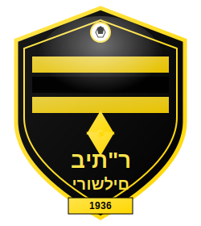
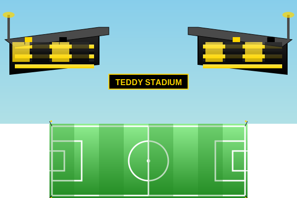
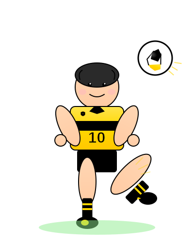
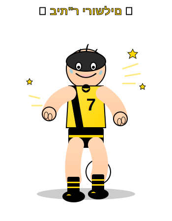

# תמונות בית"ר ירושלים / Beitar Jerusalem Images

## תמונות קיימות / Existing Images

התיקייה `assets/images/` מכילה תמונות SVG מפורטות של בית"ר ירושלים וכדורגל.

## ✨ תמונות אמיתיות של בית"ר / Real Beitar Jerusalem Images

### תמונות מציאותיות שנוספו / Added Realistic Images

✅ **לוגו מציאותי** (`beitar-realistic-logo.svg`)
- סמל מפורט עם מגן דוד (Star of David)
- כתר בחלק העליון
- הכיתוב "בית"ר" בעברית ו-"JERUSALEM" באנגלית
- שנת היסוד: EST. 1936
- גרדיאנטים זהובים ושחורים מציאותיים
- אפקט צל ותלת מימד

✅ **תג הקבוצה המפורט** (`beitar-badge.svg`)
- תג רשמי עם פסים שחורים וצהובים אופקיים
- מגן דוד מרכזי
- כדור כדורגל בחלק העליון
- הכיתוב "בית"ר ירושלים" בעברית
- באנר עם שנת היסוד 1936
- אפקט ברק (shine effect)

✅ **אצטדיון טדי** (`teddy-stadium.svg`)
- מגרש כדורגל מלא עם סימונים
- יציעים משני הצדדים בצבעי בית"ר (שחור וצהוב)
- גג ותאורה
- קהל צבעוני (שחור וצהוב)
- דגלי בית"ר ביציעים
- באנר "TEDDY STADIUM"

### ⚽ קריקטורות משחק כדורגל / Soccer Cartoons

✅ **שחקן בועט** (`cartoon-player.svg`)
- ילד מצויר בועט בכדור
- חולצת בית"ר צהובה עם פס שחור ומספר 10
- תנועה דינמית - רגל באוויר
- כדור מעופף עם קווי תנועה
- לוגו בית"ר קטן על החולצה
- אפקט הצללה

✅ **כדרור עם הכדור** (`cartoon-dribbling.svg`)
- שחקן צעיר מכדרר את הכדור
- חולצת בית"ר צהובה עם פס שחור אלכסוני ומספר 7
- הבעת פנים נלהבת ומלאת אנרגיה
- כדור ברגליים
- קווי מהירות ואפקטים
- כוכבים לאנרגיה
- הכיתוב "⚽ בית"ר ירושלים ⚽" בחלק העליון

## הוספת תמונות נוספות / Adding More Images

### 1. תמונות מומלצות / Recommended Images

- **לוגו הקבוצה**: סמל בית"ר ירושלים הרשמי
- **תמונות שחקנים**: שחקני הקבוצה הנוכחיים או לשעבר
- **תמונות מגרש**: אצטדיון טדי
- **תמונות אוהדים**: ים של צהוב ושחור באצטדיון
- **גביעים והישגים**: תמונות של גביעים שהקבוצה זכתה בהם

### 2. היכן למקם את התמונות / Where to Place Images

```
assets/
  └── images/
      ├── photos/              (תיקייה חדשה לתמונות אמיתיות)
      │   ├── logo.jpg         (לוגו הקבוצה)
      │   ├── stadium.jpg      (אצטדיון טדי)
      │   ├── players.jpg      (שחקנים)
      │   └── fans.jpg         (אוהדים)
```

### 3. שימוש בתמונות / Using Images

ניתן להוסיף תמונות למשחקים:

```html
<!-- בכותרת -->


<!-- ברקע -->
<div class="background-image" style="background-image: url('assets/images/photos/stadium.jpg')">
```

### 4. מקורות תמונות / Image Sources

מקורות מומלצים לתמונות חופשיות לשימוש:

- **אתר הקבוצה הרשמי**: https://www.fcbj.co.il/
- **ויקיפדיה**: https://he.wikipedia.org/wiki/בית%27ר_ירושלים_(כדורגל)
- **ויקימדיה Commons**: תמונות בנחלת הכלל
- **רישיון Creative Commons**: תמונות עם רישיון שימוש חופשי

### 5. הערות חשובות / Important Notes

⚠️ **שימו לב לזכויות יוצרים!** ודאו שיש לכם רשות להשתמש בתמונות.

- השתמשו רק בתמונות עם רישיון מתאים
- ציינו קרדיט למקור אם נדרש
- העדיפו תמונות בנחלת הכלל או עם רישיון Creative Commons

## תמונות SVG קיימות / Existing SVG Images

התמונות הקיימות בפרויקט:

### תמונות מציאותיות של בית"ר / Realistic Beitar Images
- `beitar-realistic-logo.svg` - לוגו מפורט עם מגן דוד, כתר ושנת יסוד
- `beitar-badge.svg` - תג הקבוצה עם פסים וסמלים
- `teddy-stadium.svg` - אצטדיון טדי עם יציעים ומגרש

### קריקטורות כדורגל / Soccer Cartoons
- `cartoon-player.svg` - שחקן בועט לשער (מספר 10)
- `cartoon-dribbling.svg` - שחקן מכדרר (מספר 7)

### אייקונים בסיסיים / Basic Icons
- `beitar-logo.svg` - לוגו סטיליזציה
- `football.svg` - כדור כדורגל
- `trophy.svg` - גביע
- `jersey.svg` - חולצת כדורגל
- `goal.svg` - שער
- `field.svg` - מגרש
- `star.svg` - כוכב
- `whistle.svg` - שריקה
- `corner-flag.svg` - דגל פינה
- `background-pattern.svg` - דוגמת רקע

## שימוש בתמונות / Using the Images

### בקובץ HTML:
```html
<!-- לוגו מציאותי בכותרת -->


<!-- תג הקבוצה -->


<!-- אצטדיון -->


<!-- קריקטורות -->


```

## לצפייה בכל התמונות / View All Images

פתחו את `images-demo.html` בדפדפן כדי לראות את כל התמונות במבנה גלריה מסודר.
